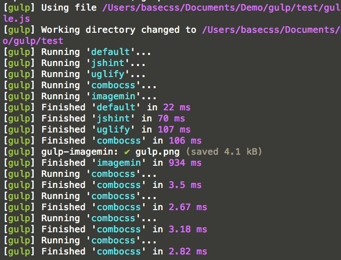

# notes

**安装**

    sudo npm install -g gulp
    
首先全局安装 `gulp`，接下来就可以在系统的任意目录中使用 `gulp` 命令了。

> windows 系统可以需要以超级管理员的方式运行 npm 命令以保证正确的全局安装。

相关命令：

    gulp -v // 查看 gulp 的版本
    gulp install --save-dev gulp // 局部安装
    npm install gulp-xxx // 安装 gulp 插件
    
**使用 gulp**

首先我们使用 `package.json` 配置依赖的插件：

```javascript
{
	"name": "useGulp",
	"description": "my first gulp project",
	"version": "0.0.1",
	"author": "basecss",
	"dependencies": {
		"gulp": "~3.3.2",
		"gulp-jshint": "~1.3.4",
		"gulp-uglify": "~0.1.0",
		"gulp-rename": "~0.2.1",
		"gulp-concat": "~2.1.7",
		"gulp-imagemin": "~0.1.4"
	}
}
```

接下来参考官方文档在项目的根目录新建一个 `gulpfile.js` 文件，(如果用过 Grunt，那么一定知道 `Gruntfile.js`)。

```javascript
var gulp = require('gulp');

var jshint = require('gulp-jshint');
var uglify = require('gulp-uglify');
var rename = require('gulp-rename');
var concat = require('gulp-concat');
var imagemin = require('gulp-imagemin');

// 新建一个 jshint 任务
gulp.task('jshint', function(){
	return gulp.src('src/js/*.js')
		.pipe(jshint())
		.pipe(jshint.reporter('default'));
});

// 压缩合并 js
gulp.task('uglify', function() {
	return gulp.src('src/js/*.js')
		.pipe(concat('all.js'))
		.pipe(gulp.dest('build/js'))
		.pipe(rename('min.js'))
		.pipe(uglify())
		.pipe(gulp.dest('build/js'));
});

// 合并 css
gulp.task('combocss', function() {
	return gulp.src('src/css/*.css')
		.pipe(concat('all.css'))
		.pipe(gulp.dest('build/css'))
		.pipe(rename('style.css'))
		.pipe(gulp.dest('build/css'));
});

// 优化图片
gulp.task('imagemin', function() {
	return gulp.src('src/img/**')
		.pipe(gulp.dest('build/img'))
		.pipe(imagemin({optimizationLevel: 5}))
		.pipe(gulp.dest('build/img'))
});

// default task
gulp.task('default', function() {
	
	gulp.run('jshint', 'uglify', 'combocss', 'imagemin');
	
	// 监控文件变化
	gulp.watch('src/js/**', function(){
		gulp.run('jshint', 'uglify');
	});
	
	gulp.watch('src/css/**', function(){
		gulp.run('combocss');
	});
	
});
``` 

**安装依赖：**

    npm install
   
> 也可以一个一个单独安装。

首先在文件的顶部引入依赖，然后使用 gulp 提供的 API 配置任务。此处省略 n 字。

注意最后的 `default` 任务，默认执行前面已经定义的多个任务，同时监控 `js` `css` 文件的变化，根据文件变化执行指定的任务。

**运行任务：**

    gulp
    
如果指向运行指定的任务，如 `jshint` 任务，那么执行 `gulp jshint` 即可。

可以指定同时运行多个任务，单个任务之间使用空格分割即可。

